# Digital-Comms-SDR-Advanced-Modulation-Sub-Nyquist-Signal-Analysis
This repository documents experiments in Digital Communication Systems and Software-Defined Radio (SDR). It explores passband modulation using Shift Keying techniques, DSSS for interference resistance, and undersampling in SDR. Modules include hardware results, mathematical analysis, and evaluations of bandwidth and BER performance.

## TABLE OF CONTENTS
* [Part A: Digital Passband Modulation (ASK & FSK)](#part-a-digital-passband-modulation-ask--fsk)
* [Part B: Phase Shift Keying (BPSK & QPSK)](#part-b-phase-shift-keying-bpsk--qpsk)
* [Part C: Direct Sequence Spread Spectrum (DSSS)](#part-c-direct-sequence-spread-spectrum-dsss)
* [Part D: SDR & Undersampling](#part-d-sdr--undersampling)
* [Results & Data Analysis](#results--data-analysis)

## Part A: Digital Passband Modulation (ASK & FSK)
### 1. Amplitude Shift Keying (ASK)
In digital communications, Amplitude Shift Keying (ASK) represents the simplest form of passband modulation. It is a technique where the amplitude of a high-frequency carrier signal is switched between two levels (typically "On" and "Off") in response to a binary digital message. This experiment demonstrates the "Switching Method" of generation and the use of Asynchronous Envelope Detection to recover data in a simulated noisy environment.
#### 1.1 ASK Generation (The Switching Method)
A high-frequency carrier ($100\text{ kHz}$ Sine) was fed into the input of a Dual Analog Switch. A $2\text{ kHz}$ digital bitstream was applied to the control terminal:
- Logic '1' (High): The switch closes, allowing the carrier to pass to the output.
- Logic '0' (Low): The switch opens, resulting in zero output voltage.
#### 1.2 Signal Recovery (Envelope Detection & Restoration)
To restore the digital bitstream at the receiver, a three-stage demodulation chain was implemented:
- Rectification: The incoming ASK signal was passed through a Utilities Module (Rectifier) to convert the bipolar carrier into a unipolar signal.
- Envelope Extraction: A Tuneable Low-Pass Filter was used to remove the $100\text{ kHz}$ carrier ripples, leaving behind the "envelope" of the original message.
- Decision Circuit (The Comparator): Because the filtered signal had rounded edges and integration distortion, it was passed through a Comparator with a Variable DC Threshold. This effectively "squared up" the signal and restored sharp transitions.

#### **Amplitude Shift Keying (ASK) Experimental Diagrams**

View Part A - 1 diagrams

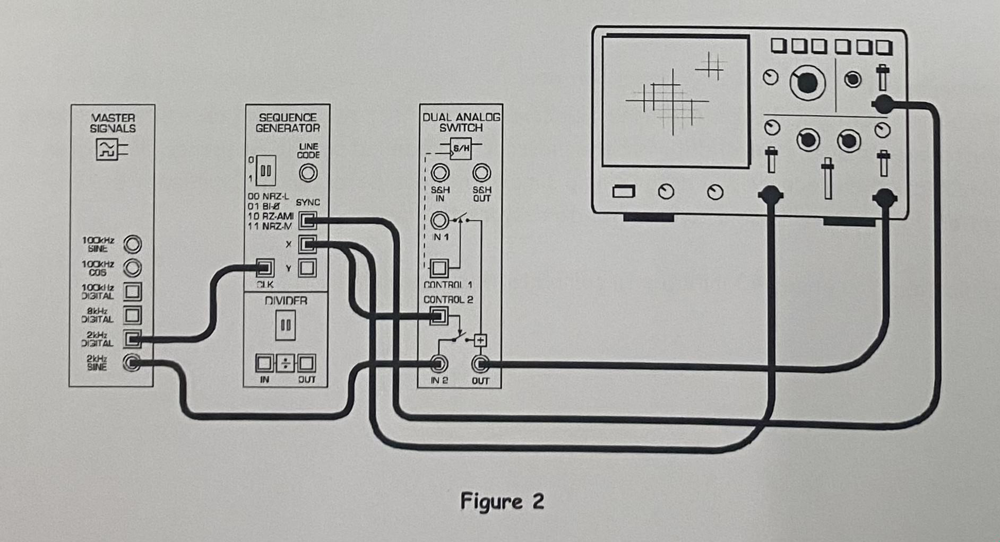
*Figure 3.4.1: Generating ASK Signal Setup.*
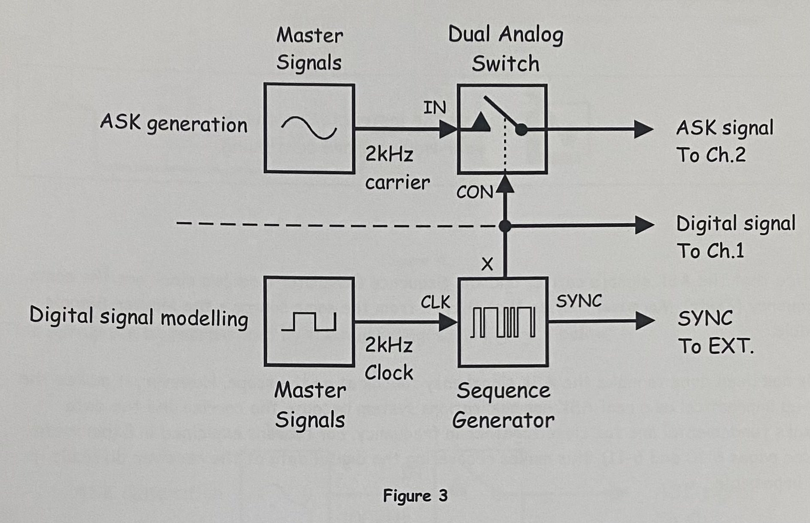
*Figure 3.4.2: Generating ASK Signal Diagram.*
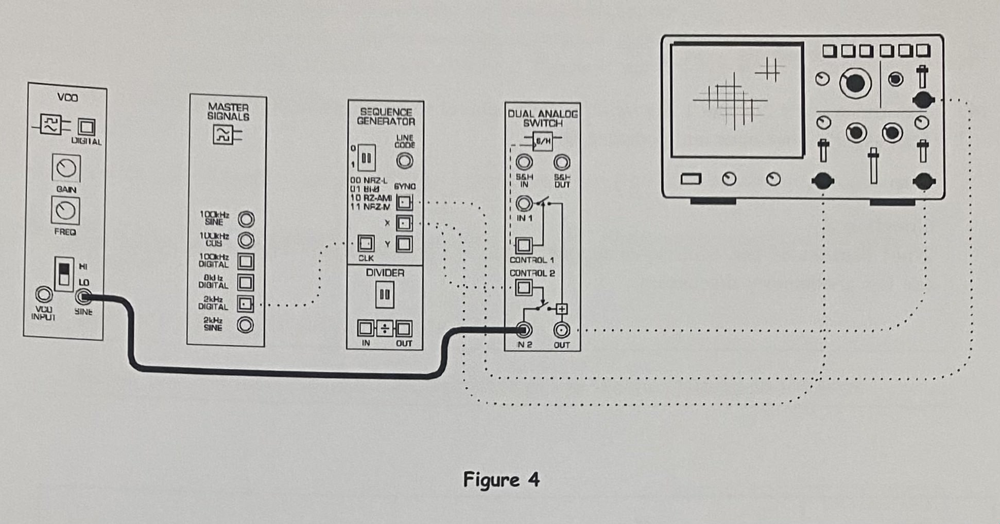
*Figure 3.4.3: Generating ASK Signal Setup 2.*
(1).jpg)
*Figure 3.4.4: Generating ASK Signal Diagram 2.*
.jpg)
*Figure 3.4.5: Demodulating ASK Signal Setup.*
.jpg)
*Figure 3.4.6: Demodulating ASK Signal Diagram.*
.jpg)
*Figure 3.4.7: Restoring recovered ASK Signal Setup.*
(1).jpg)
*Figure 3.4.8: Restoring recovered ASK Signal Diagram.*

#### **Amplitude Shift Keying (ASK) Experimental Results**

View Part A - 1 Documentation

*Figure 3.5.1: Internal CAL signal showing the verified 1Vp-p square wave.*

*Figure 3.5.2: Internal CAL signal showing the square wave with 1khz frequency and 1ms period.*

*Figure 3.5.3: Internal CAL signal showing the square wave with 1khz frequency and 1ms period zoomed in for manual computation.*

### 2. Frequency Shift Keying (FSK)
Frequency Shift Keying (FSK) maintains a constant carrier amplitude but varies the frequency to represent digital states. Because the information is carried in the timing (zero-crossings) rather than signal strength, FSK is inherently more robust against amplitude-based interference than ASK. This experiment demonstrates FSK generation using a Voltage Controlled Oscillator (VCO) and recovery via a Zero-Crossing Detector.
#### 2.1 FSK Generation (VCO Switching)
The FSK signal was generated using the VCO module. A $2\text{ kHz}$ digital bitstream was applied to the VCO's DATA input:
- Logic '0' (Low): The VCO outputs a lower frequency carrier ($f_1$).
- Logic '1' (High): The VCO outputs a higher frequency carrier ($f_2$).
#### 2.2 Signal Recovery (Zero-Crossing Detection)
Demodulation was achieved using a Zero-Crossing Detector (ZCD) approach:
- Squaring & Pulse Generation: The ZCD produces a fixed-width pulse at every zero-crossing of the incoming signal. The higher frequency ($f_2$) produces a higher density of pulses per unit of time.
- Integration: A Tuneable Low-Pass Filter averages these pulses. The higher pulse density of $f_2$ results in a higher average DC voltage, while $f_1$ results in a lower voltage, recreating the original square wave bitstream.

#### **Frequency Shift Keying (FSK) Experimental Diagrams**

View Part A - 2 diagrams

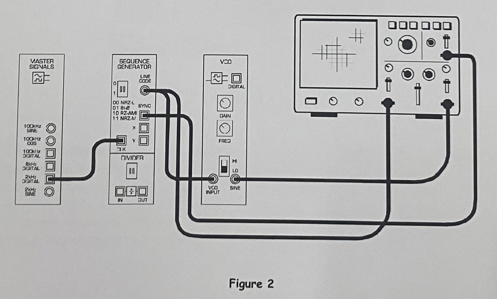
*Figure 3.4.1: Generating FSK Signal Setup.*

*Figure 3.4.2: Generating FSK Signal Diagram.*
.jpg)
*Figure 3.4.3: Demodulating FSK Signal Setup .*
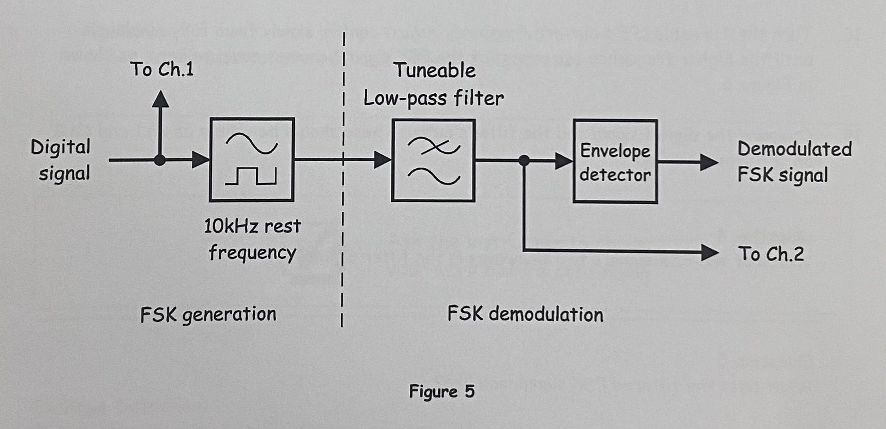
*Figure 3.4.4: Demodulating FSK Signal Diagram .*
.jpg)
*Figure 3.4.5: Restoring recovered FSK Signal Setup .*
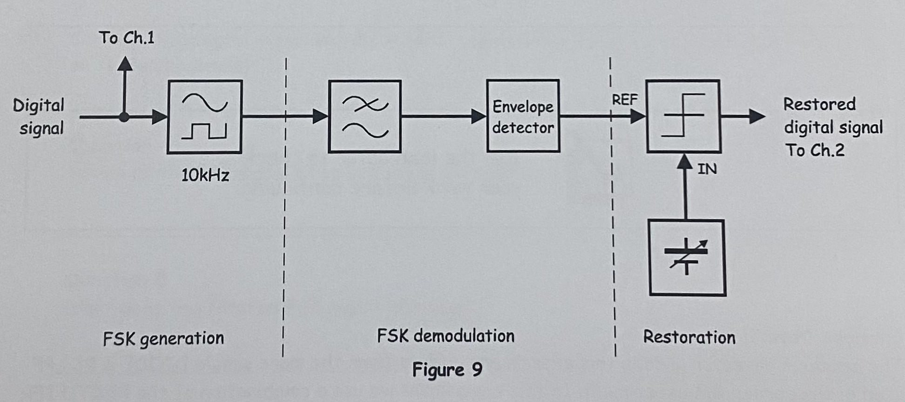
*Figure 3.4.6: Restoring recovered FSK Signal Diagram .*

#### **Frequency Shift Keying (FSK) Experimental Results**

View Part A - 2 Documentation

*Figure 3.5.1: Internal CAL signal showing the verified 1Vp-p square wave.*

*Figure 3.5.2: Internal CAL signal showing the square wave with 1khz frequency and 1ms period.*

*Figure 3.5.3: Internal CAL signal showing the square wave with 1khz frequency and 1ms period zoomed in for manual computation.*

## Part B: Phase Shift Keying (BPSK & QPSK)
### 1. Binary Phase Shift Keying (BPSK)
Binary Phase Shift Keying (BPSK) is a robust digital modulation scheme where binary data is encoded as $180^\circ$ phase shifts of a constant-amplitude carrier. By utilizing the maximum possible phase separation between the two states, BPSK offers superior performance in low Signal-to-Noise Ratio (SNR) environments. This experiment focuses on generation via a Balanced Modulator and recovery through Coherent Product Detection.
#### 1.1 BPSK Generation (The Balanced Modulator Method)
BPSK was generated by multiplying a $100\text{ kHz}$ sinusoidal carrier by a bipolar digital message ($+V$ and $-V$):
- Bipolar Signal Conversion: A standard TTL digital signal (0V to 5V) was converted to a bipolar signal using the Buffer Amplifier and Inverter modules.
- Modulation: The Multiplier module acted as a balanced modulator. When the message is $+V$ (Logic 1), the carrier maintains its phase ($0^\circ$). When the message is $-V$ (Logic 0), the carrier is inverted, resulting in a $180^\circ$ phase reversal.
#### 1.2 Signal Recovery (Coherent Detection)
Because the envelope of a BPSK signal is constant, traditional asynchronous detection (like ASK) is impossible. Recovery requires Coherent Detection:
- Product Detection: The received signal is multiplied by a locally synchronized "stolen" carrier.
- Filtering & Restoration: A Tuneable Low-Pass Filter extracts the unipolar bitstream from the multiplication products, and a Comparator restores the sharp digital transitions.

#### **Phase Shift Keying (BPSK) Experimental Diagrams**

View Part B - 1 diagrams

.jpg)
*Figure 3.4.1: Generating a BPSK Signal Setup.*

*Figure 3.4.2: Generating a BPSK Signal Diagram.*

*Figure 3.4.1: Demodulating a BPSK Signal Setup.*
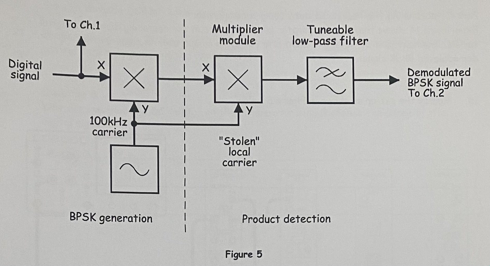
*Figure 3.4.2: Demodulating a BPSK Signal Diagram.*
.jpg)
*Figure 3.4.1: Restoring recovered a BPSK Signal Setup.*
.jpg)
*Figure 3.4.2: Restoring recovered a BPSK Signal Diagram.*

#### **Phase Shift Keying (BPSK) Experimental Results**

View Part B - 1 Documentation

*Figure 3.5.1: Internal CAL signal showing the verified 1Vp-p square wave.*

*Figure 3.5.2: Internal CAL signal showing the square wave with 1khz frequency and 1ms period.*

*Figure 3.5.3: Internal CAL signal showing the square wave with 1khz frequency and 1ms period zoomed in for manual computation.*

### 2. Quadrature Phase Shift Keying (QPSK)
Quadrature Phase Shift Keying (QPSK) is a bandwidth-efficient modulation scheme that transmits two bits per symbol. By using four distinct phase states ($45^\circ, 135^\circ, 225^\circ, 315^\circ$), QPSK doubles the data rate of BPSK without increasing the required spectral bandwidth. This experiment explores parallel bit-splitting and quadrature carrier summation.
#### 2.1 QPSK Generation (The IQ Modulator)
The QPSK signal was constructed by splitting a high-speed serial bitstream into two slower parallel streams:
- Bit Splitting: The data was divided into an In-phase (I) and Quadrature (Q) stream. This effectively halves the bit rate in each channel.
- Quadrature Carriers: A $100\text{ kHz}$ sine wave and a $100\text{ kHz}$ cosine wave (shifted by $90^\circ$) were modulated by the I and Q streams respectively.
- Summation: These two signals were combined in an Adder module to produce the final QPSK waveform.
#### 2.2 Signal Recovery (Parallel Coherent Detection)
Because I and Q components are orthogonal, they are recovered independently:
- Demodulation: The signal is fed into two separate Product Detectors driven by In-phase and Quadrature local carriers.
- Filtering: Individual Tuneable LPFs extract the baseband I and Q streams before they are recombined into a single serial bitstream.

#### **Phase Shift Keying (BPSK) Experimental Diagrams**

View Part B - 2 diagrams

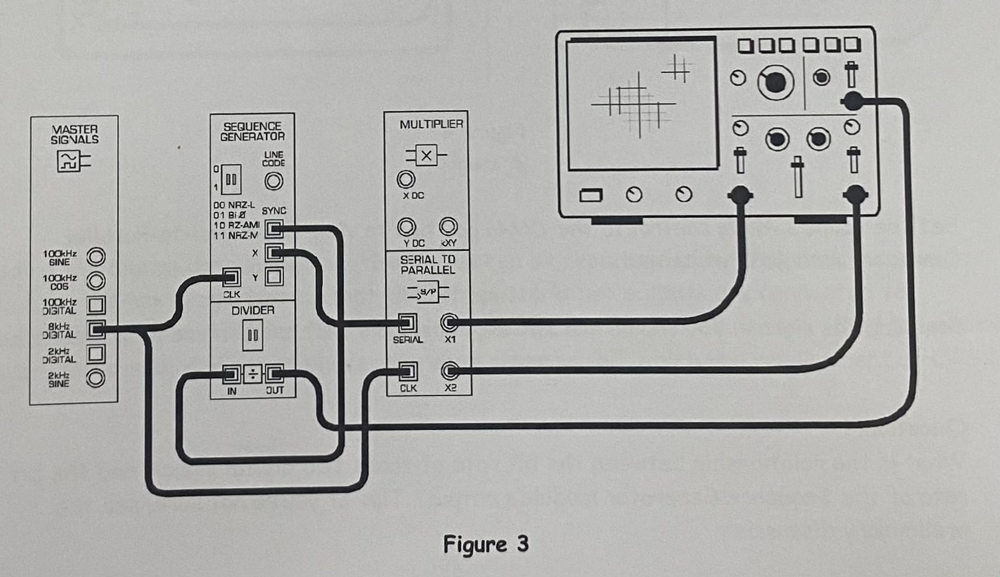
*Figure 3.4.1: Generating QPSK Signal Setup.*
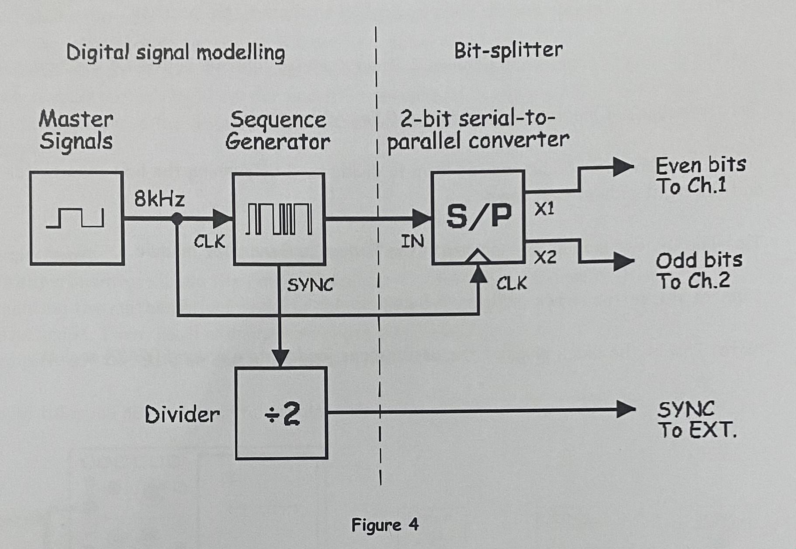
*Figure 3.4.2: Generating QPSK Signal Setup.*

*Figure 3.4.1: Generating QPSK Signal Setup 2.*

*Figure 3.4.2: Generating QPSK Signal Setup 2.*
.jpg)
*Figure 3.4.1: Generating QPSK Signal Setup 3.*
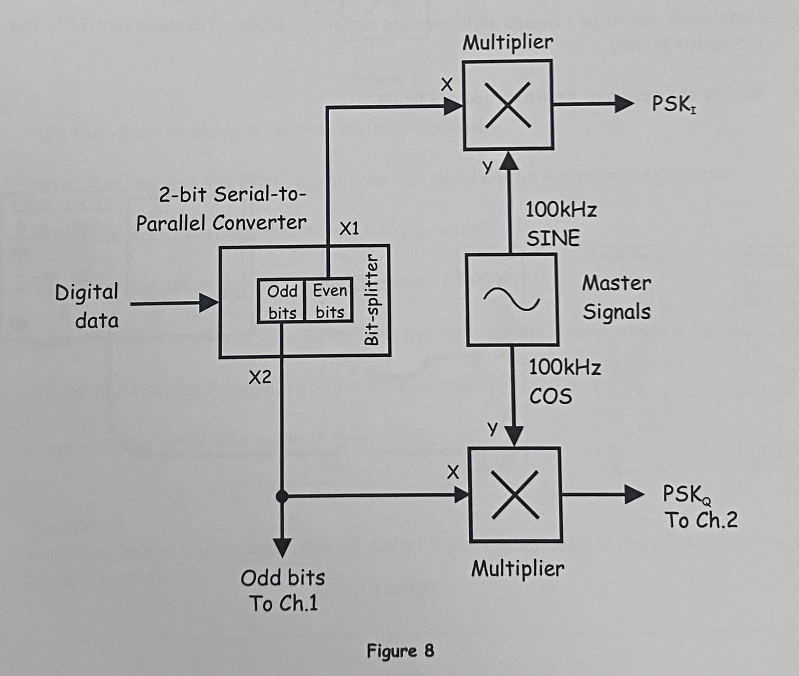
*Figure 3.4.2: Generating QPSK Signal Setup 3.*
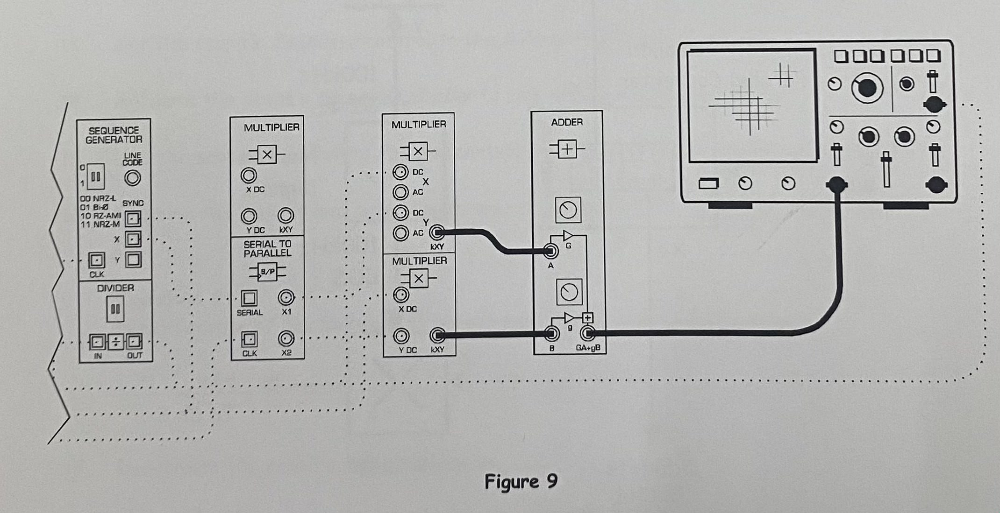
*Figure 3.4.1: Generating QPSK Signal Setup 4.*

*Figure 3.4.2: Generating QPSK Signal Setup 4.*

*Figure 3.4.1: Picking out one of QPSK Signal Setup.*

*Figure 3.4.2: Picking out one of QPSK Signal Setup.*
.jpg)
*Figure 3.4.1: Picking out one of QPSK Signal Setup 2.*

*Figure 3.4.2: Picking out one of QPSK Signal Setup 2.*

#### **Phase Shift Keying (QPSK) Experimental Results**

View Part B - 2 Documentation

*Figure 3.5.1: Internal CAL signal showing the verified 1Vp-p square wave.*

*Figure 3.5.2: Internal CAL signal showing the square wave with 1khz frequency and 1ms period.*

*Figure 3.5.3: Internal CAL signal showing the square wave with 1khz frequency and 1ms period zoomed in for manual computation.*

## PART C: Direct Sequence Spread Spectrum (DSSS)
Direct Sequence Spread Spectrum (DSSS) is a modulation technique where the transmitted signal occupies much more bandwidth than the original information signal. By multiplying the digital message with a high-speed Pseudo-Noise (PN) sequence (or "chipping code"), the signal's power is spread across a wide frequency range. This results in a signal that is resistant to intentional jamming, interference, and eavesdropping, as it appears as low-level noise to unauthorized receivers.
#### 1.1 Spreading (The Transmitter)
- The spreading process was implemented using a Sequence Generator and an Exclusive-OR (XOR) logic gate (or Multiplier):
- The Chipping Code: A high-speed PN sequence was generated at a rate significantly higher than the $2\text{ kHz}$ message bit rate.
- The XOR Operation: Each bit of the digital message was XORed with multiple "chips" of the PN sequence.
  - If the message bit is '0', the PN sequence is transmitted normally.
  - If the message bit is '1', the PN sequence is inverted.
- Result: The narrow-band message is "spread" into a wide-band signal. The resulting power spectral density is so low that the signal can effectively operate below the noise floor of conventional receivers.
#### 1.2 Despreading & Recovery (The Receiver)
Recovery of the original data requires a process known as Correlation:
- Synchronization: The receiver uses an identical PN Sequence Generator, clocked at the exact same frequency and synchronized in time with the transmitter's sequence.
- The Despreading XOR: The incoming spread signal is XORed again with the local PN code. Because $A \oplus B \oplus B = A$, the high-speed chipping code is removed, "collapsing" the wide-band signal back into the original narrow-band message.
- Integration: A Low-Pass Filter is used to smooth out any high-frequency spikes caused by minor timing misalignments, followed by a Comparator to restore the digital bitstream.

#### **Direct Sequence Spread Spectrum (DSSS) Experimental Diagrams**

View Part C diagrams

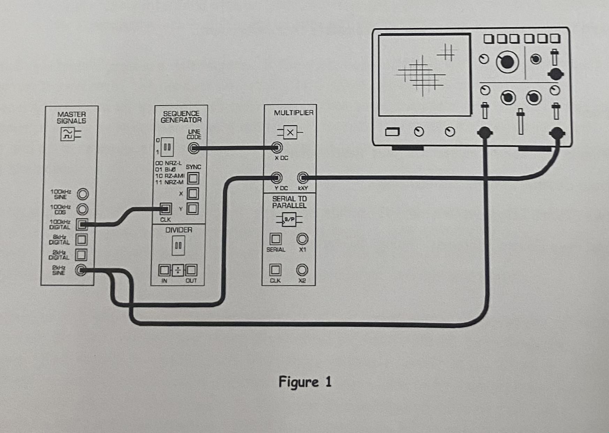
*Figure 3.4.1: Generating DSSS Signal Setup.*
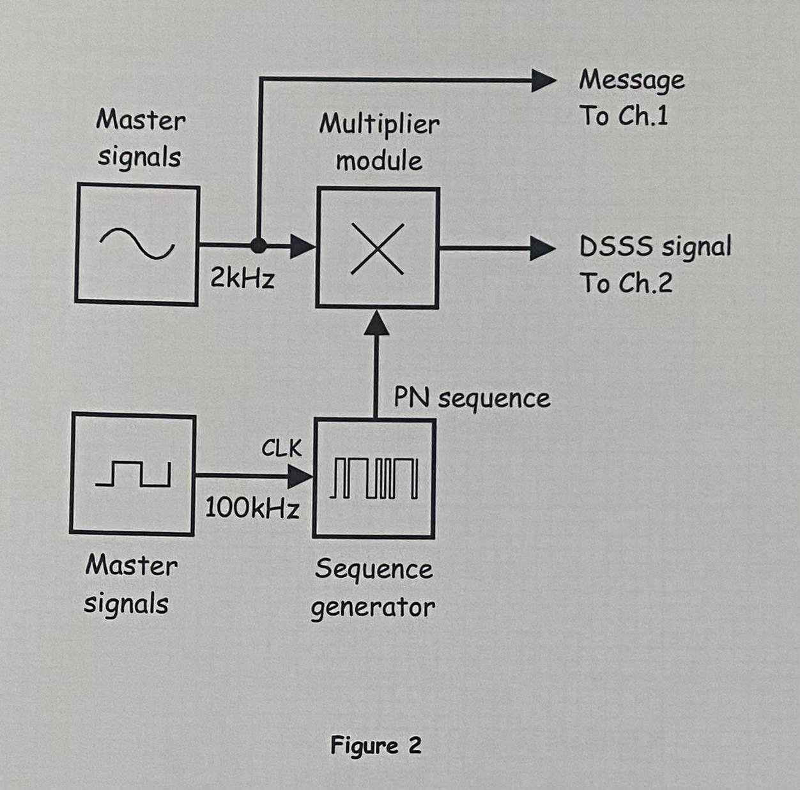
*Figure 3.4.2: Generating DSSS Signal Setup.*

*Figure 3.4.1: Using Product Detector to recover the message Setup.*
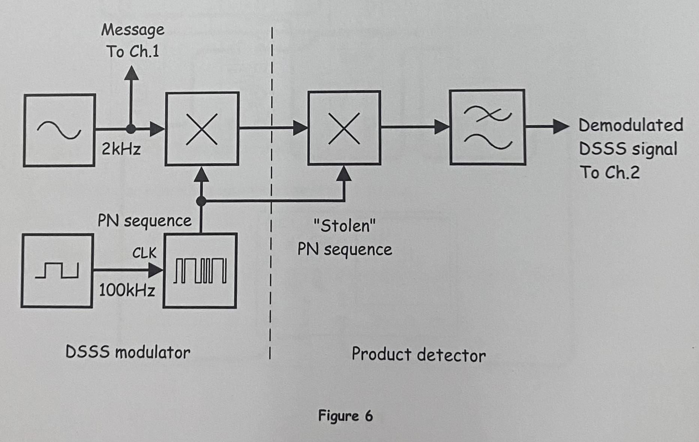
*Figure 3.4.2: Using Product Detector to recover the message Diagram.*

*Figure 3.4.1: DSSS and Deliberate interference Setup.*

*Figure 3.4.2: DSSS and Deliberate interference Setup 2.*

#### **Direct Sequence Spread Spectrum (DSSS) Experimental Results**

View Part C Documentation

*Figure 3.5.1: Internal CAL signal showing the verified 1Vp-p square wave.*

*Figure 3.5.2: Internal CAL signal showing the square wave with 1khz frequency and 1ms period.*

*Figure 3.5.3: Internal CAL signal showing the square wave with 1khz frequency and 1ms period zoomed in for manual computation.*

## PART D: SDR & Undersampling
Software Defined Radio (SDR) is a communication system where components that have typically been implemented in hardware (e.g., mixers, filters, amplifiers, modulators/demodulators) are instead implemented by means of software on a personal computer or embedded system. A core technique in SDR is Undersampling (Sub-Nyquist Sampling), which allows high-frequency signals to be down-converted to baseband digitally by intentionally exploiting the phenomenon of aliasing.
#### 1.1 The Undersampling Architecture
Traditional sampling requires $f_s > 2 \times f_{max}$. However, for a band-limited signal, we can sample at a much lower rate, provided that $f_s > 2 \times B$ (where $B$ is the bandwidth).
- The S/H Module: In this experiment, the Sample-and-Hold (S/H) module acts as the sampling bridge. By sampling a $100\text{ kHz}$ carrier at a significantly lower rate (e.g., $10\text{ kHz}$), the signal "aliases" down into a lower frequency range.
- Nyquist Zones: The frequency spectrum is divided into zones of width $f_s / 2$. Undersampling translates the signal from a higher Nyquist zone down to the first Nyquist zone (baseband), effectively performing the job of a local oscillator and mixer.
#### 2.2 Software-Based Recovery
Once the signal is undersampled and held, it is passed through an Analog-to-Digital Converter (ADC) to be processed by software:
- Digital Filtering: Unlike the tuneable analog filters used in previous parts, SDR uses software algorithms (like FIR or IIR filters) to isolate the digital bitstream.
- Flexibility: The primary advantage shown is that a single hardware front-end can be reconfigured via software to demodulate ASK, FSK, or BPSK signals simply by changing the decoding logic.
 

#### **SDR & Undersampling Experimental Diagrams**

View Part D diagrams

.jpg)
*Figure 3.4.1: Setting up a limmited bandwidth signal Setup.*
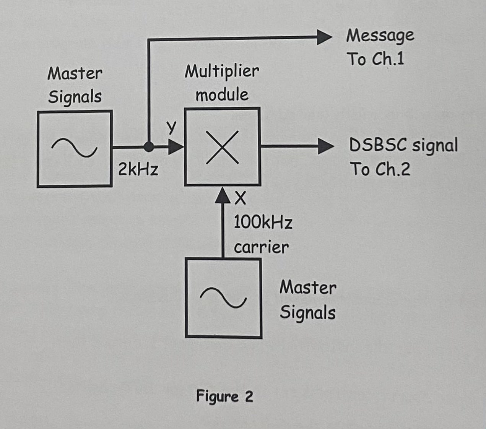
*Figure 3.4.2: Setting up a limmited bandwidth signal Setup.*
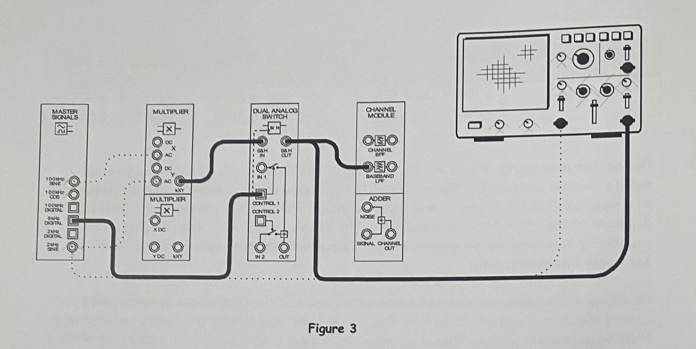
*Figure 3.4.1: Direct down conversion using sampling Setup.*
.jpg)
*Figure 3.4.2:  Direct down conversion using sampling Setup.*
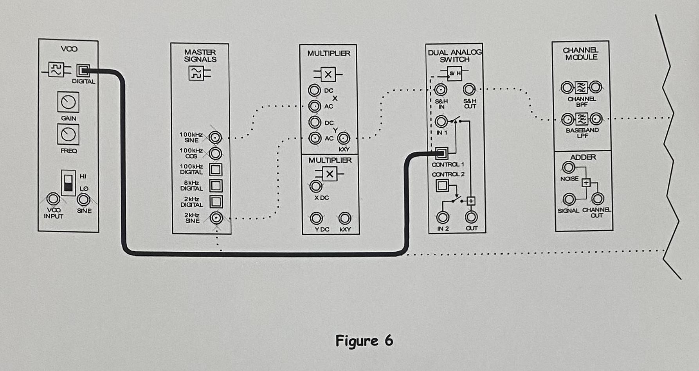
*Figure 3.4.1: Synchronization Setup.*

#### **SDR & Undersampling Experimental Results**

View Part D Documentation

*Figure 3.5.1: Internal CAL signal showing the verified 1Vp-p square wave.*

*Figure 3.5.2: Internal CAL signal showing the square wave with 1khz frequency and 1ms period.*

*Figure 3.5.3: Internal CAL signal showing the square wave with 1khz frequency and 1ms period zoomed in for manual computation.*

## Results & Data Analysis

**[View or Download Complete Experimental Data (PDF)](Data/Q&A-Digital-Comms-SDR-Advanced-Modulation-Sub-Nyquist-Signal-Analysis.pdf)**

## Project Resources
For full access to the raw datasets, formulas, and the complete Q&A worksheet, please use the links below:

* **[Download Complete Experimental Q&A (PDF)](Data/Q&A-Digital-Comms-SDR-Advanced-Modulation-Sub-Nyquist-Signal-Analysis.pdf)**
* **[Browse All Captured Documentation](Waveform_Captures/)**

